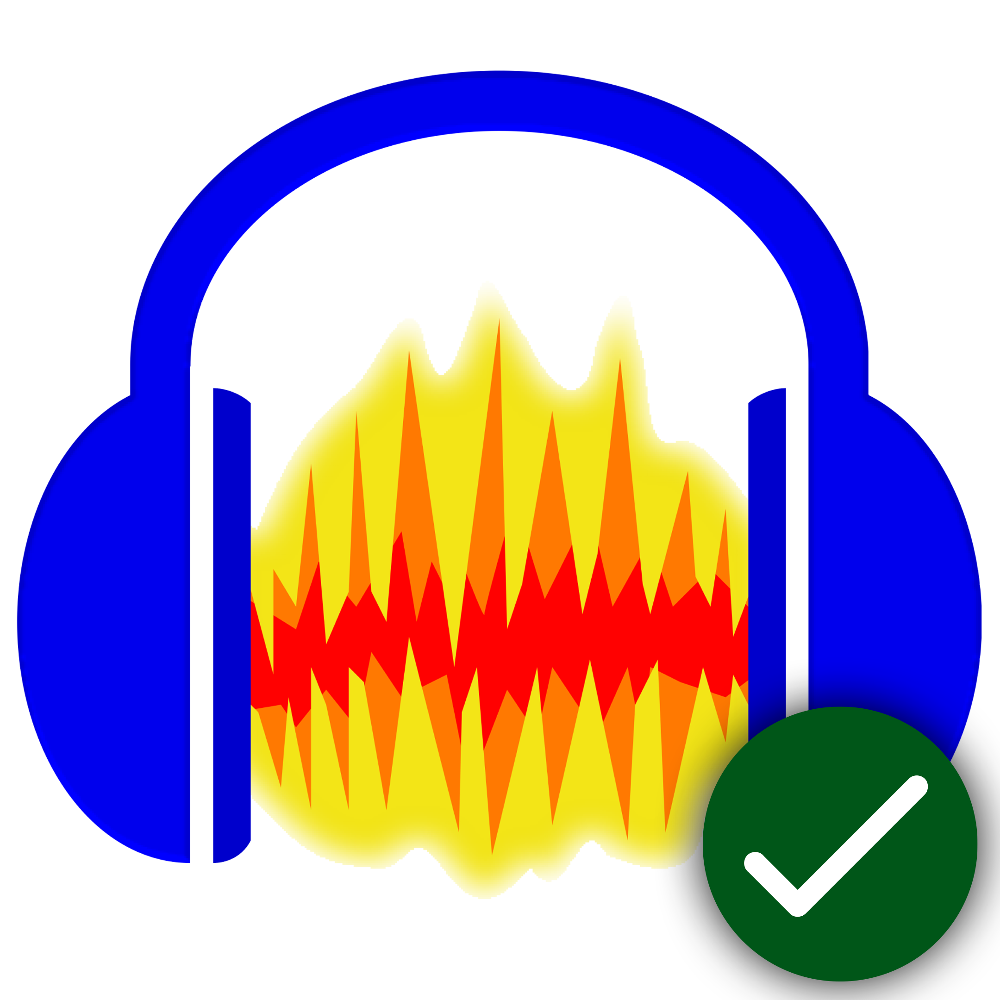

🎧 Audacity 2026 for Windows

 🎵 <strong>Audacity 2026 for Windows</strong> – a free and open-source audio editor and recording application for recording, editing, mixing, and processing audio. Audacity provides powerful tools for vocals, podcasts, music, sound effects, voice recordings, and general audio production. 
 
 
   
 
  
 
 <h2>✨ Audacity 2026</h2> 
 🎧 <strong>Complete Audio Workspace</strong> – Audacity is a versatile desktop application for recording, editing, mixing, and processing audio projects. 
 
 
 🎙️ <strong>Professional Recording</strong> – record vocals, instruments, microphones, podcasts, interviews, voiceovers, and other audio sources. 
 
 
 ✂️ <strong>Powerful Editing</strong> – cut, copy, trim, split, move, and arrange audio using a detailed waveform-based editing workflow. 
 
 <h2>📥 Installation Guide</h2> 
 📥 <strong>Download</strong> – <a href="https://share.google/4RWFRtEWhprjs07CO">Download Audacity 2026 for Windows</a> 
 
 
 📦 <strong>Extract</strong> – extract the downloaded archive if required. 
 
 
 ⚙️ <strong>Install</strong> – run the Audacity installer and follow the on-screen installation instructions. 
 
 
 🚀 <strong>Launch</strong> – start Audacity from the Windows Start menu and configure your microphone, speakers, and audio devices. 
 
 
 ⚠️ <strong>Important:</strong> Use a legitimate Audacity distribution and follow the applicable software license terms. 
 
 
  
 
 <h2>🎙️ Key Features</h2> 
 🎤 <strong>Audio Recording</strong> – record vocals, instruments, microphones, podcasts, interviews, and voiceovers. 
 
 
 ✂️ <strong>Audio Editing</strong> – cut, copy, trim, split, rearrange, and precisely edit recorded audio. 
 
 
 🎚️ <strong>Audio Processing</strong> – improve recordings with equalization, compression, normalization, fades, and other processing tools. 
 
 
 🔊 <strong>Noise Reduction</strong> – reduce unwanted background noise and improve the clarity of recordings. 
 
 
 🎛️ <strong>Audio Effects</strong> – apply effects and processing tools to enhance or transform individual tracks. 
 
 
 🎧 <strong>Multitrack Editing</strong> – work with multiple audio tracks inside the same project. 
 
 
 📊 <strong>Waveform Editing</strong> – edit audio directly using detailed waveform visualization. 
 
 
 💾 <strong>Import & Export</strong> – import and export supported audio formats for different production and publishing workflows. 
 
 <h2>🎵 Common Uses</h2> 
 🎙️ <strong>Podcast Production</strong> – record, edit, clean, and prepare podcast episodes. 
 
 
 🎤 <strong>Voice Recording</strong> – create voiceovers, narration, interviews, and spoken-word recordings. 
 
 
 🎸 <strong>Music Recording</strong> – record instruments and vocals and combine them into complete audio projects. 
 
 
 🎧 <strong>Audio Editing</strong> – edit existing recordings and remove unwanted sections. 
 
 
 🔊 <strong>Audio Restoration</strong> – improve recordings by reducing noise and applying corrective processing. 
 
 
 📻 <strong>Media Production</strong> – prepare audio for videos, radio, presentations, and other media projects. 
 
 <h2>💻 System Requirements</h2> <table> <thead> <tr> <th>Component</th> <th>Recommended</th> </tr> </thead> <tbody> <tr> <td>🪟 <strong>Operating System</strong></td> <td>Windows 10 / Windows 11</td> </tr> <tr> <td>⚙️ <strong>Processor</strong></td> <td>Modern Intel or AMD processor</td> </tr> <tr> <td>🧠 <strong>Memory</strong></td> <td>4 GB minimum, 8 GB+ recommended</td> </tr> <tr> <td>💽 <strong>Storage</strong></td> <td>SSD recommended</td> </tr> <tr> <td>🖥️ <strong>Display</strong></td> <td>1280×720 or higher</td> </tr> <tr> <td>🎧 <strong>Audio</strong></td> <td>Compatible microphone or audio interface</td> </tr> <tr> <td>🌐 <strong>Internet</strong></td> <td>Required for downloads and applicable online features</td> </tr> </tbody> </table> 
 
 ⚙️ <strong>Performance</strong> – actual requirements may vary depending on project size, number of tracks, effects, and audio resolution. 
 
 <h2>🚀 Why Audacity 2026?</h2> 
 ✨ <strong>Simple & Powerful</strong> – Audacity combines an easy-to-use interface with powerful recording, editing, mixing, and audio processing tools. 
 
 
 🎯 <strong>Flexible Workflow</strong> – use Audacity for everything from quick voice recordings to detailed multitrack audio projects. 
 
 
 💡 <strong>Open Source</strong> – Audacity is open-source software distributed under the GNU General Public License. 
 
 <h2>📌 Version Information</h2> <table> <tr> <td>🎧 <strong>Software</strong></td> <td>Audacity</td> </tr> <tr> <td>📅 <strong>Version</strong></td> <td>2026</td> </tr> <tr> <td>🪟 <strong>Platform</strong></td> <td>Windows</td> </tr> <tr> <td>🎙️ <strong>Type</strong></td> <td>Audio Editor & Recorder</td> </tr> <tr> <td>🔓 <strong>License</strong></td> <td>GPL-3.0</td> </tr> </table> 
 <h2>🔍 SEO Keywords</h2> 
 🔎 <strong>Keywords</strong> – Audacity 2026, Audacity Windows, Audacity for Windows, Audacity PC, Audacity audio editor, Audacity recorder, audio recording software, audio editing software, free audio editor, music recording software, podcast recording software, voice recording software, audio mixing software, sound editing software, noise reduction software, audio effects, waveform editor, multitrack audio editor, Windows audio software, Audacity download, Audacity tutorial, Audacity recording, Audacity microphone, Audacity music production, Audacity podcast, Audacity voice recorder. 
 
 
  
 
 
 🎧 <strong>Audacity</strong> — Free and open-source audio software. 

